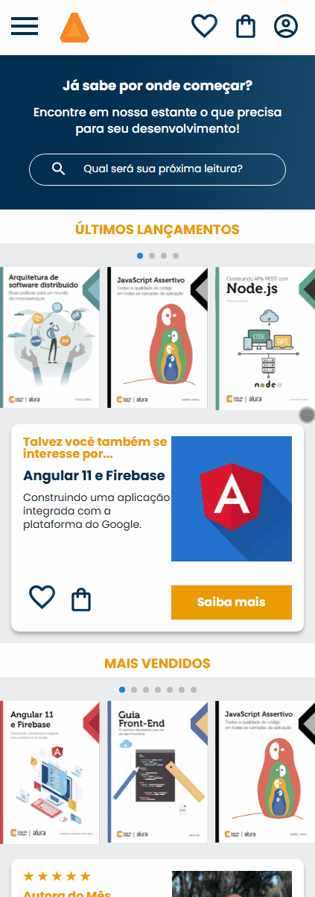

# 📚 My Book Page

[](https://developer.mozilla.org/pt-BR/docs/Web/HTML)
[](https://developer.mozilla.org/pt-BR/docs/Web/CSS)

[](https://my-book-page-seven.vercel.app/)

---

Projeto desenvolvido durante um curso da [Alura](https://www.alura.com.br/), com foco em **HTML**, **CSS** e principalmente **responsividade**.  
A proposta foi criar uma página fictícia para apresentação de um livro, utilizando a abordagem **mobile-first** e aplicando técnicas modernas de layout com **Flexbox** e **media queries**.

## 🔍 Prévia

Você pode visualizar o projeto ao vivo por meio da Vercel:  
👉 [Clique aqui para acessar](https://my-book-page-seven.vercel.app/)

## 🎥 Preview do Projeto (GIF)


  
## 💡 O que aprendi

Durante o curso e desenvolvimento do projeto, aprendi:

- Como **interpretar um protótipo criado no Figma**
- A estruturar um site completo com HTML e CSS
- A aplicar a abordagem **mobile-first** para garantir uma boa experiência em dispositivos móveis
- A utilizar **media queries** para adaptar o layout para tablets e desktops
- A trabalhar com **Flexbox** para construir layouts responsivos e flexíveis
- A incorporar uma **imagem de fundo em elementos de formulário**
- A importar bibliotecas externas para criar um **carrossel funcional**
- A construir um **menu hambúrguer funcional com apenas HTML e CSS**
- A realizar o **deploy de um site na Vercel**
- A interagir com listas, seções, inputs customizados e elementos reutilizáveis
- A simular cenários reais de desenvolvimento como sessões de "mais vendidos", "últimos acessos", "contato" e rodapés com múltiplas colunas

## 🧱 Estrutura do layout

A página conta com as seguintes seções principais:

- **Capa do livro**  
- **Sinopse e informações do autor**  
- **Depoimentos e chamadas para ação**  
- **Seção de livros mais vendidos**  
- **Lista de tópicos visitados recentemente**  
- **Formulário de contato com input estilizado**  
- **Rodapé completo com diversas categorias**

## 🧠 Sobre o curso

- Este projeto faz parte do curso de **HTML e CSS: responsividade com mobile-first** da Alura.  
- Durante as aulas, desenvolvemos a interface do site **AluraBooks**, com foco em técnicas modernas de front-end. O curso também incentivou a autonomia na criação de seções personalizadas, consolidando os conhecimentos adquiridos.

## 📁 Como executar o projeto

Você pode clonar este repositório localmente e abrir o arquivo `index.html` no navegador:

```bash
git clone https://github.com/Eduardox64/my-book-page.git
cd my-book-page
```

Depois, abra o arquivo index.html no seu navegador favorito.

## 🧑‍💻 Desenvolvido com dedicação por [Eduardox64](https://github.com/Eduardox64)
